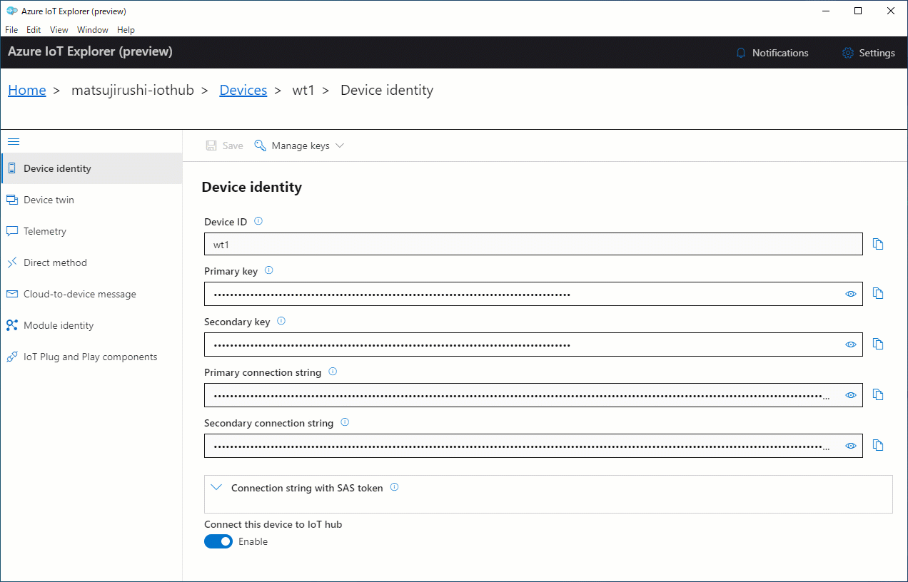
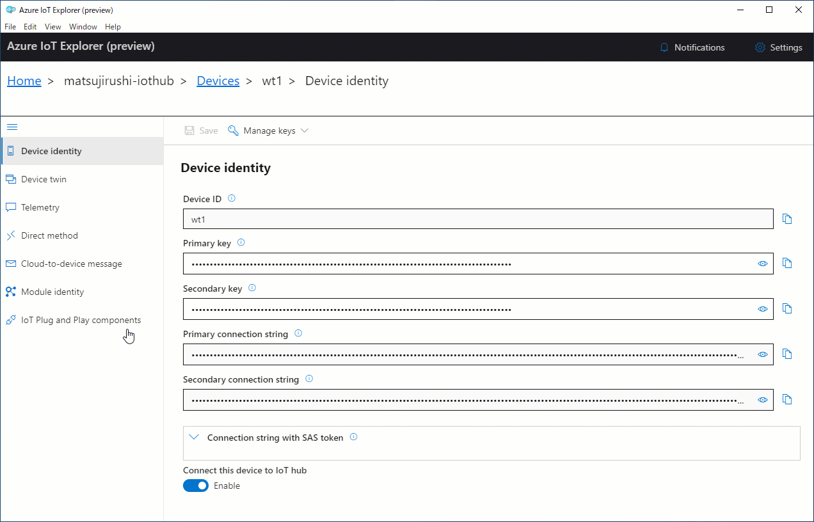

# Welcome to wioterminal-aziot-example

This application shows you how to connect your [Wio Terminal](https://www.seeedstudio.com/Wio-Terminal-p-4509.html) from Seeed to [Azure IoT Hub](https://azure.microsoft.com/services/iot-hub). It is built on top of the [Azure SDK for Embedded C](https://github.com/Azure/azure-sdk-for-c), a small footprint, easy-to-port library for communicating with Azure services.

As the Wio Terminal is one of PlatformIO's (many!) supported platforms, the application is conveniently made available as a PlatformIO project. This means that you don't have to worry about installing the [multiple Arduino libraries](https://wiki.seeedstudio.com/Wio-Terminal-Network-Overview/) the Wio Terminal requires for Wi-Fi & TLS, and you don't need to manually install any other third-party library either! All dependencies are automatically fetched from Github by the PlatformIO Library Manager.

  - [Supported device attestation methods](#supported-device-attestation-methods)
  - [Update the Wi-Fi Firmware](#update-the-wi-fi-firmware)
  - [Configure directly connect to Azure IoT Hub](#configure-directly-connect-to-azure-iot-hub)
  - [Configure use provisioning to connect to Azure IoT Hub](#configure-use-provisioning-to-connect-to-azure-iot-hub)
  - [Running the application](#running-the-application)
  - [Testing the application](#testing-the-application)
  - [A few words on the Azure SDK for Embedded C and how it's been ported to Wio Terminal](#a-few-words-on-the-azure-sdk-for-embedded-c-and-how-its-been-ported-to-wio-terminal)

## Supported device attestation methods

The following table summarizes supported device attestation/authentication methods :

| Service       | Enrollment | Authentication           | Support status |
|:--------------|:-----------|:-------------------------|:---------------|
| Azure IoT Hub | -          | Symmetric Key            | Need recompile |
| Azure IoT Hub | -          | X.509 Self-Signed        | Not Supported  |
| Azure IoT Hub | -          | X.509 CA-Signed          | Not Supported  |
| Azure IoT DPS | Group      | Symmetric Key            | **Supported** |
| Azure IoT DPS | Group      | CA Certificate           | Not Supported  |
| Azure IoT DPS | Group      | Intermediate Certificate | Not Supported  |
| Azure IoT DPS | Individual | Symmetric Key            | **Supported** |
| Azure IoT DPS | Individual | X.509                    | Not Supported  |
| Azure IoT DPS | Individual | TPM                      | Not Supported  |

## Update the Wi-Fi Firmware

Please follow instruction at [Wio Terminal's network overview page](https://wiki.seeedstudio.com/Wio-Terminal-Network-Overview/#update-the-wireless-core-firmware) to update the firmware.

> You must use the version of Wi-Fi firmware specified in Azure IoT Firmware.
> See [the release page](https://github.com/SeeedJP/wioterminal-aziot-example/releases).

## Configure directly connect to Azure IoT Hub

> If you use provisioning service, skip this section.

### Configure Azure IoT Hub

1. Create an Azure IoT Hub.
See [here](https://docs.microsoft.com/en-us/azure/iot-dps/quick-setup-auto-provision#create-an-iot-hub).
Do "Create an IoT hub" section only.
1. Select **IoT devices** page in your Azure IoT Hub on Azure portal.
1. Select **+New**.
1. Input **Device ID** and click **Save** button.

### Configure Application

1. Open `include/config.h` in text editor.
1. Comment out `#define USE_CLI`.
1. Modify **[wifi ssid]** to your Wi-Fi SSID.
1. Modify **[wifi password]** to your Wi-Fi password.
1. Modify **[Azure IoT Hub host name]** to hostname of your Azure IoT Hub.
1. Modify **[device id]** to the Device ID of the device.
1. Modify **[symmetric key]** to primary key or secondary key of the device.

## Configure use provisioning to connect to Azure IoT Hub

> If you DON'T use provisioning service, skip this section.

### Create Azure IoT Hub

1. Create an Azure IoT Hub.
See [here](https://docs.microsoft.com/en-us/azure/iot-dps/quick-setup-auto-provision#create-an-iot-hub).
Do "Create an IoT hub" section only.

### Configure Azure IoT Hub DPS

1. Create an Azure IoT Hub DPS.
See [here](https://docs.microsoft.com/en-us/azure/iot-dps/quick-setup-auto-provision#create-a-new-iot-hub-device-provisioning-service).
Do "Create a new IoT Hub Device Provisioning Service" section only.
1. Link Azure IoT Hub and Azure IoT Hub DPS.
See [here](https://docs.microsoft.com/en-us/azure/iot-dps/quick-setup-auto-provision#link-the-iot-hub-and-your-device-provisioning-service).
Do "Link the IoT hub and your Device Provisioning Service" section only.
1. Select **Manage enrollments** page in your Azure IoT Hub DPS on Azure portal.
1. Select **+Add individual enrollment**.
1. Change X.509 at **Mechanism** to **Symmetric Key**.
1. Input **Registration ID**.
1. Input **IoT Hub Device ID**.
1. Click **Save** button.

### Configure application

1. Open `include/config.h` in text editor.
1. Comment out `#define USE_CLI`.
1. Uncomment `#define USE_DPS`.
1. Modify **[wifi ssid]** to your Wi-Fi SSID.
1. Modify **[wifi password]** to your Wi-Fi password.
1. Modify **[id scope]** to hostname of your Azure IoT Hub DPS.
1. Modify **[registration id]** to the Registration ID of the indivisual enrollment.
1. Modify **[symmetric key]** to primary key or secondary key of the individual enrollment.

## Running the application

Use the [PlatformIO IDE](https://marketplace.visualstudio.com/items?itemName=platformio.platformio-ide) (VS Code extension) or the [PlatformIO command-line interface](https://platformio.org/install/cli) to deploy the application to your Wio Terminal. 

Once running, the application will connect to IoT Hub and: 

* send **telemetry**—the acceleration values from the 3-axis acceleration sensor—every 2 second.
* listen to a `ringBuzzer` **command** that, when triggered from the Cloud will... ring the buzzer! The duration is provided as a command parameter.

## Testing the Application

You can use the [Azure IoT Explorer](https://github.com/Azure/azure-iot-explorer/releases) to test that your Wio Terminal is properly connected to Azure IoT Hub, i.e that it is regularly sending telemetry data, and responding to commands.

### Testing that telemetry is correctly sent to Azure IoT Hub

To **check that telemetry data is correctly sent**, you will want to subscribe to the telemetry feed of your device. Since this code leverages IoT Plug and Play, Azure IoT Explorer will provide you with extra information regarding the data model for your acceleration sensor data (e.g the unit of measurement being "g") if you enable the "Show modeled events" option.

### Sending a command from Azure IoT Hub

In order to send the `ringBuzzer` command, head over to the "Commands" section of the IoT Plug and Play default component of your device, enter a duration, and send the command.

## A few words on the Azure SDK for Embedded C and how it's been ported to Wio Terminal

Note: As of today, the Azure SDK for Embedded C is still being actively developed, therefore, it hasn't been officially released as an Arduino or PlatformIO library. To make it easier for you to get started, the Azure IoT client libraries have been included in the [`lib/azure-sdk-for-c`](lib/azure-sdk-for-c) folder. You can synchronize them with the latest version from the Embedded C SDK github repository by running the [`lib/download_aziot_embedded_c_lib.sh`](download_aziot_embedded_c_lib.sh) script.

You can read more on the Azure IoT client library [here](https://github.com/Azure/azure-sdk-for-c/tree/master/sdk/docs/iot#azure-iot-clients), but in a nutshell, here's what had to be done to get the Wio Terminal connected:

* As this application uses symmetric keys to authenticate, a [security token](https://docs.microsoft.com/en-us/azure/iot-hub/iot-hub-devguide-security#security-tokens) needs to be generated.
  * Since the generated token has an expiration date (typically set to a few hours in the future), **we need to know the current date and time**. We use an [NTP](https://github.com/sstaub/NTP) library to get the current time from a time server.
  * The token includes an **HMAC-SHA256 signature string that needs to be base64-encoded**. Luckily, the [recommended WiFi+TLS stack](https://wiki.seeedstudio.com/Wio-Terminal-Network-Overview/#libraries-installation) of the Wio Terminal already includes Mbed TLS, making it relatively simple to compute HMAC signatures (ex. `mbedtls_md_hmac_starts`) and perform base64 encoding (ex. `mbedtls_base64_encode`).
* The Azure IoT client libraries help with crafting MQTT topics that follow the [Azure IoT conventions](https://docs.microsoft.com/en-us/azure/iot-hub/iot-hub-mqtt-support), but you still need to **provide your own MQTT library**. In fact, that is a major difference with the historical Azure IoT C SDK, for which the MQTT implementation was baked into it. Since it is widely supported and just worked out-of-the-box, this application uses the [`PubSubClient`](https://github.com/knolleary/pubsubclient) MQTT library from [Nick O'Leary](https://github.com/knolleary).
* And of course, one has to implement their own **application logic**. For this application, this meant using the Wio Terminal's acceleration sensor driver to get acceleration data every 2 seconds, or hooking up the `ringBuzzer` command to actual embedded code that rings the buzzer.

## Author

👤 **Benjamin Cabé**

* Website: https://blog.benjamin-cabe.com
* Twitter: [@kartben](https://twitter.com/kartben)
* Github: [@kartben](https://github.com/kartben)
* LinkedIn: [@benjamincabe](https://linkedin.com/in/benjamincabe)

👤 **Seeed K.K.**

* Website: https://www.seeed.co.jp/
* Twitter: [@SeeedJP](https://twitter.com/SeeedJP)

## 🤝 Contributing

Contributions, issues and feature requests are welcome!

Feel free to check [issues page](https://github.com/SeeedJP/wioterminal-aziot-example/issues).

## Show your support

Give a ⭐️ if this project helped you!

## 📝 License

Copyright &copy; 2020 [Benjamin Cabé](https://github.com/kartben).  
Copyright &copy; 2020 Seeed K.K.

This project is [MIT](/LICENSE) licensed.

***
_This README was generated with ❤️ by [readme-md-generator](https://github.com/kefranabg/readme-md-generator)_
