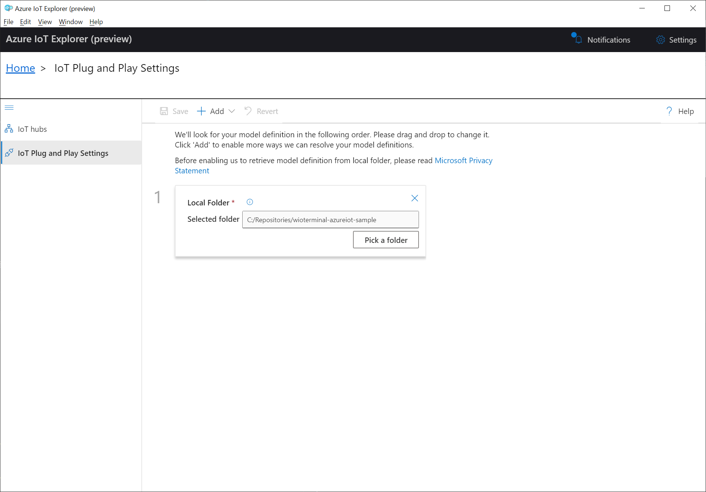

# Welcome to wioterminal-azureiothub-sample 👋
[](/LICENSE)
[](https://twitter.com/kartben)
[](https://travis-ci.org/kartben/wioterminal-azureiothub-sample)

This sample application shows you how to connect your [Wio Terminal](https://www.seeedstudio.com/Wio-Terminal-p-4509.html) from Seeed Studio to [Azure IoT Hub](https://azure.microsoft.com/services/iot-hub). 

It is built on top of the [Azure SDK for Embedded C](https://github.com/Azure/azure-sdk-for-c), a small footprint, easy-to-port library for communicating with Azure services.

As [PlatformIO](https://platformio.org/) [supports](https://docs.platformio.org/en/latest/boards/atmelsam/seeed_wio_terminal.html) the Wio Terminal, the sample comes in the form a PlatformIO project. This means that you don't have to worry about installing the [multiple Arduino libraries](https://wiki.seeedstudio.com/Wio-Terminal-Network-Overview/) the Wio Terminal requires for Wi-Fi & TLS, and you don't need to manually install any other third-party library either! All dependencies are automatically fetched from Github by the PlatformIO Library Manager.

## Running the sample

In order to run the sample, update the macro declarations in [``config.h``](include/config.h) with your Wi-Fi SSID and password, as well as IoT Hub credentials (IoT hostname, device ID, and device key).

```cpp
// Wifi
#define IOT_CONFIG_WIFI_SSID            "SSID"
#define IOT_CONFIG_WIFI_PASSWORD        "PWD"

// Azure IoT
#define IOT_CONFIG_IOTHUB_FQDN          "[your Azure IoT host name].azure-devices.net"
#define IOT_CONFIG_DEVICE_ID            "Device ID"
#define IOT_CONFIG_DEVICE_KEY           "Device Key"
```

Use the [PlatformIO IDE](https://marketplace.visualstudio.com/items?itemName=platformio.platformio-ide) (VS Code extension) or the [PlatformIO command-line interface](https://platformio.org/install/cli) to deploy the application to your Wio Terminal. 

Once running, the sample will connect to IoT Hub and: 

* send **telemetry**—the acceleration values from the IMU sensor—every 2 second.
* listen to a `ringBuzzer` **command** that, when triggered from the Cloud will... ring the buzzer! The duration is provided as a command parameter.

## Testing the sample

You can use the [Azure IoT Explorer](https://github.com/Azure/azure-iot-explorer/releases) to test that your Wio Terminal is properly connected to Azure IoT Hub, i.e that it is regularly sending telemetry data, and responding to commands.

Since the IoT Plug and Play model ID used in this sample does not correspond to any official/certified model, you will have to manually instruct Azure IoT Explorer about a local folder where the actual model corresponding to model ID `dtmi:seeed:wioterminal;1` resides. 

You can either manually download [``wioterminal.json``](./wioterminal.json) or clone this repository, and then add the corresponding local folder in the "IoT Plug and Play Settings" of your Azure IoT Explorer. You'll find more information on configuring Azure IoT Explorer [here](https://docs.microsoft.com/en-us/azure/iot-pnp/howto-use-iot-explorer#connect-to-your-hub).



To **check that telemetry data is correctly sent**, you will want to subscribe to the telemetry feed of your device. Since this code sample leverages IoT Plug and Play, Azure IoT Explorer will provide you with extra information regarding the data model for your IMU sensor data (e.g the unit of measurement being "g") if you enable the "Show modeled events" option.


In order to send the `ringBuzzer` command, head over to the "Commands" section of the IoT Plug and Play default component of your device, enter a duration, and send the command.


## A few words on the Azure C SDK and how it's been ported to Wio Terminal

TODO

## Author

👤 **Benjamin Cabé**

* Website: https://blog.benjamin-cabe.com
* Twitter: [@kartben](https://twitter.com/kartben)
* Github: [@kartben](https://github.com/kartben)
* LinkedIn: [@benjamincabe](https://linkedin.com/in/benjamincabe)

## 🤝 Contributing

Contributions, issues and feature requests are welcome!

Feel free to check [issues page](https://github.com/kartben/wioterminal-azureiothub-sample/issues).

## Show your support

Give a ⭐️ if this project helped you!


## 📝 License

Copyright &copy; 2020 [Benjamin Cabé](https://github.com/kartben).

This project is [MIT](/LICENSE) licensed.

***
_This README was generated with ❤️ by [readme-md-generator](https://github.com/kefranabg/readme-md-generator)_